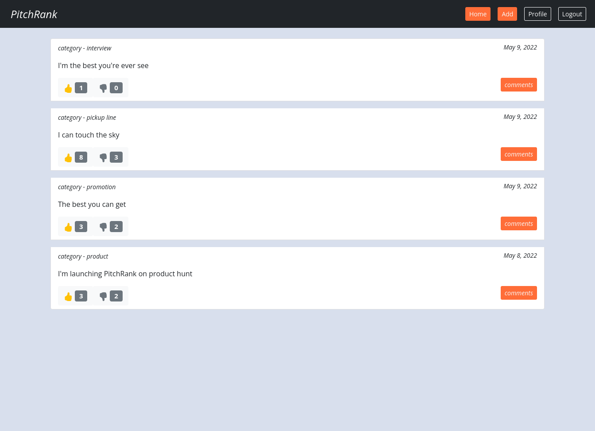
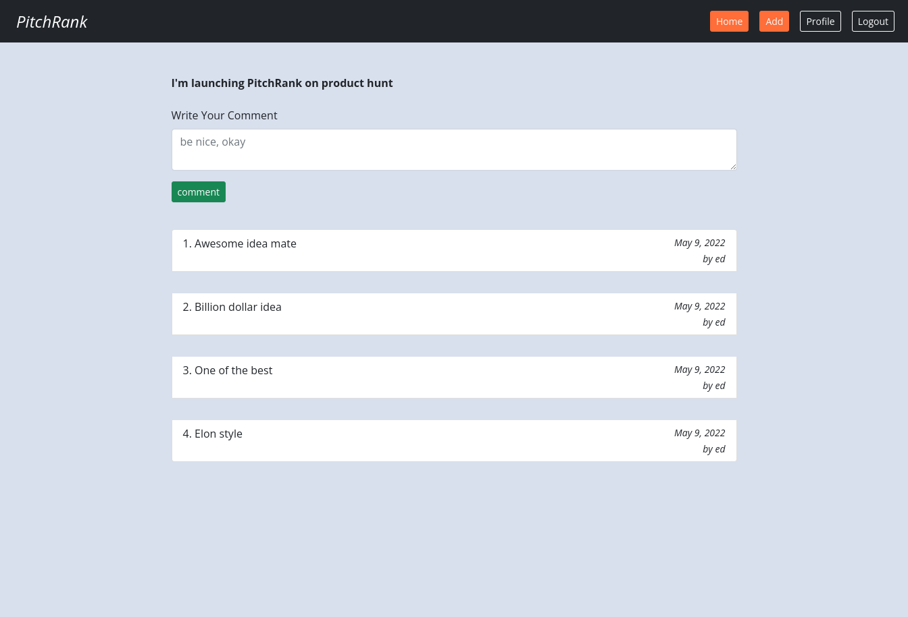

# Pitches-Webapp

A flask web app for submitting pitches

### By: Edwin Karimi

## Table of Content

- [Description](#description)
- [Installation Requirement](#usage)
- [Technology Used](#technologies)
- [Licence](#licence)
- [Authors Info](#author-info)

## Description


<br>
<br>
This is a pitches website that allows users to submit their pitches and other users can like, dislike and comment on
them. It more like reddit but for pitches. <br>
First the user has to sign up and login with valid credentials. If a user want's to submit their pitch they can do so by
adding a new pitch in the Add page. The pitch is then added to the pitch list with the most recent pitch being added at
the top. <br> Other users, can then like or dislike the pitch. They can also add a comment to the pitch. In the comment
page, the commenter also gets to see other comments belonging to that pitch. <br>
After a user wants to exit the session, all they have to do is click logout and their session will be closed redirecting
them to the login page.<br>
After logout, the user cannot access the homepage, add pitch page, comment page or any other page in the website that
requires login.<br>
While logged in, the user can see his/her details in the profile page. They can also upload a profile picture or update
the existing one.


<br>
<br>

## Behaviour Driven Development

The user is able to;

- Sign up

- Login

- See all pitches with their author and date
- Add a pitch
- Comment on a pitch
- See all comments for a pitch with the commenter and date of posting
- Like a pitch
- Dislike a pitch
- Upload a profile picture
- Update the profile picture

### Requirements

- A computer

- Access to the Internet

### 1. Local Repository

- Make sure you have a stable internet to have the ability to clone the repository.
- Type the following command in your terminal to clone this repository

```
git clone https://github.com/Edu58/Flask-Pitches-Webapp.git
```

If you are using SSH, use the following command

```
git clone git@github.com:Edu58/Flask-Pitches-Webapp.git
```

When you run the commands successfully, you should have a local version of this repository.

### Usage

To run the app, unzip the cloned folder if it is zipped. Otherwise, navigate inside the folder and
run ```python manage.py runserver``` or ```python manage.py server``` in your terminal. Any of these 2 should start the
server at
localhost:5000. Once the server is running, open your browser and enter localhost:5000 in your url bar of your
preferred browser, and you should be able to use the app now. This will only work on the computer running the server. It
is not available to anyone else.

### 2. Online Repository

- Make sure you have a stable internet for forking this repository.
- According to the license, you can fork this project. You need to click on the forking icon, and it will be added as
  one
  of your repositories

Feel free to fork the project and have fun with it. Happy coding!

## Technologies

- Flask
- PostgreSQL

## Licence

Copyright (c) Edwin Karimi 2022 - [MIT Licence](LICENSE)

## Author Info

- Twitter - [@GISDevEd](https://twitter.com/GISDevEd)
- Linkedin - [edwin-karimi](https://www.linkedin.com/in/edwin-karimi/)
